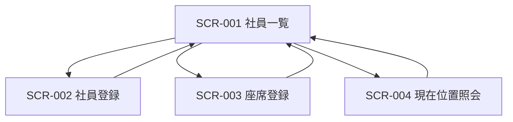

# OfficeNavi 画面一覧・画面遷移（MVP）

## 1. 画面一覧

| 画面ID  | 画面名           | 主目的                       | 利用API                                                                          |
| ------- | ---------------- | ---------------------------- | -------------------------------------------------------------------------------- |
| SCR-001 | 社員一覧画面     | 社員情報を一覧表示する       | GET /api/users                                                                   |
| SCR-002 | 社員登録画面     | 社員を新規登録する           | POST /api/users                                                                  |
| SCR-003 | 座席登録画面     | 社員の着席/退席を実行する    | GET /api/users, GET /api/seats, POST /api/user-seats, POST /api/user-seats/leave |
| SCR-004 | 現在位置照会画面 | 指定社員の現在座席を確認する | GET /api/users/{userId}/current-seat                                             |

## 2. 画面遷移図（初版）

## 3. 画面別の状態

- SCR-001 社員一覧画面
  - 初期表示: 社員一覧取得
  - 空状態: データ0件メッセージを表示
  - エラー: 再読込ボタンを表示
- SCR-002 社員登録画面
  - 入力中: バリデーションエラーを項目下に表示
  - 登録成功: 成功通知後にSCR-001へ遷移
  - 登録失敗: エラー内容を上部通知
- SCR-003 座席登録画面
  - 初期表示: 社員一覧/座席一覧を取得
  - 着席成功: 成功通知
  - 退席成功: 成功通知
  - 競合(409): 該当座席が利用中である旨を表示
- SCR-004 現在位置照会画面
  - 照会成功: ユーザー名・座席名・位置を表示
  - 404: 対象なしメッセージを表示

## 4. ルーティング方針（案）

- /users
- /users/new
- /seats/assign
- /users/current-seat

## 5. 共通UI要件

- ローディング中は操作不可にし、二重送信を防止する。
- APIエラーは画面上部に統一フォーマットで表示する。
- フォーム送信ボタンは必須項目未入力時に非活性化する。
